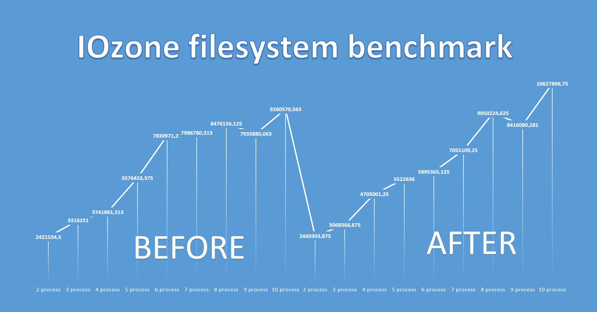

# Linux-disk-optimization
Script for disk optimization for linux

#### Setup

```
# Install git;

sudo apt-get -y install git;

# Make tmp directory and clone Linux-disk-optimization;

cd /;
sudo mkdir /tmp;
cd /tmp;
git clone https://github.com/Caripson/Linux-disk-optimization.git;

# run script

chmod +x /tmp/Linux-disk-optimization/runme.sh;
/tmp/Linux-disk-optimization/runme.sh;


```



```
Record size = 8 kBytes
Output is in kBytes/sec

iozone -R -b /root/bench_u02_test.xls -r 8k -s 100m -l 2 -u 10

```
